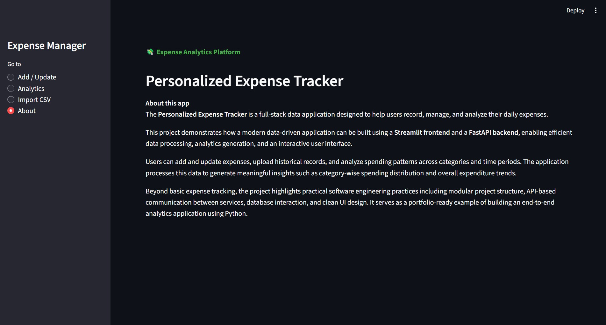
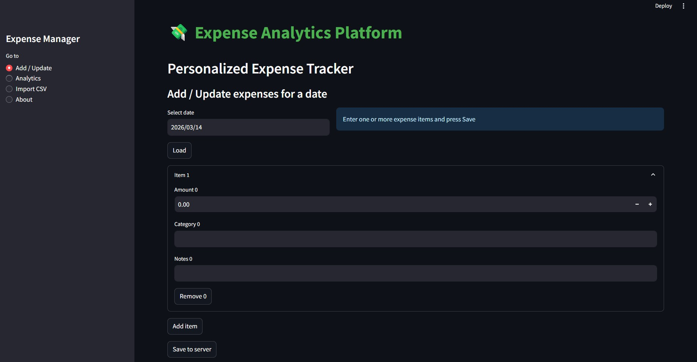
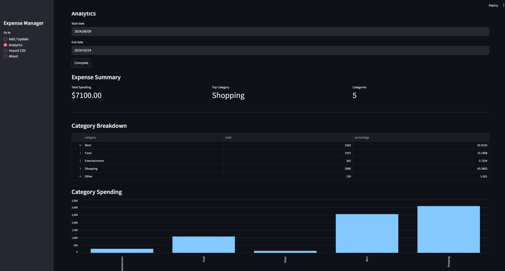
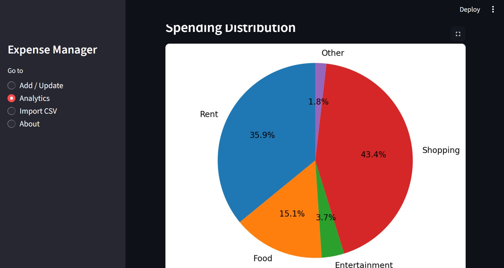
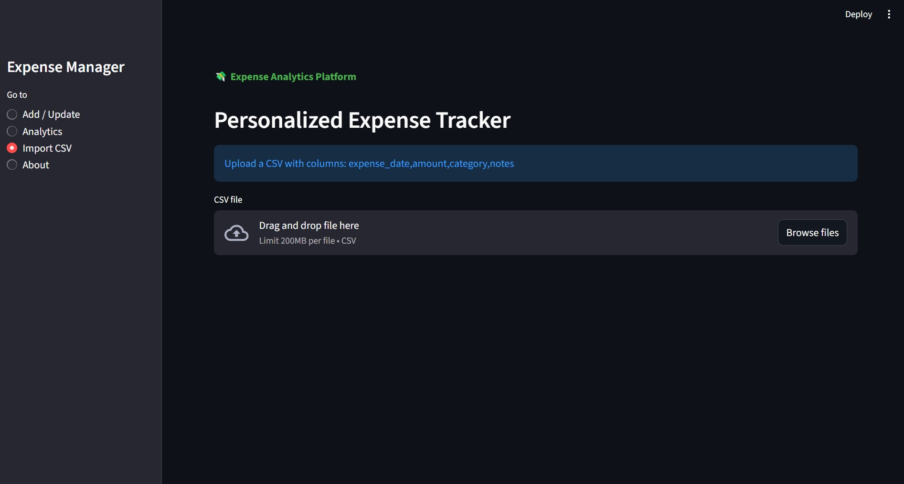

# 💰 Personalized Expense Tracker

A full-stack **Expense Analytics Platform** that allows users to record, manage, and analyze their daily expenses through an interactive web interface.

The application combines a **Streamlit frontend**, a **FastAPI backend**, and a **SQL-based database layer** to provide real-time financial insights and expense analytics.

This project demonstrates how to build a **modular, full-stack Python data application** with API communication between services.

---

# 📊 Project Overview

The **Personalized Expense Tracker** enables users to:

* Add and update daily expenses
* Import historical expense records
* Analyze spending patterns across categories
* Generate expense summaries for custom date ranges
* Visualize spending trends using charts and dashboards

The system separates **UI, backend logic, and database operations**, making the application scalable and maintainable.

---

# 🏗️ Application Architecture

```id="arch001"
Streamlit Frontend
        │
        │ HTTP API Requests
        ▼
FastAPI Backend
        │
        │ SQL Queries
        ▼
SQL Database
```

The frontend interacts with the backend via REST APIs, while the backend handles database queries and analytics calculations.

---

# 🧰 Tech Stack

### Programming Language

* Python

### Frontend

* Streamlit

### Backend

* FastAPI
* Uvicorn

### Database

* SQL (via Python database connector)

### Data Handling

* Pandas

### API Communication

* Requests

### Data Validation

* Pydantic

---

# 📂 Project Structure

```id="struct001"
PROJECT_RESOURCES
│
├── backend
│   ├── db_helper.py        # Database helper functions
│   ├── logging_setup.py    # Logging configuration
│   ├── server.py           # FastAPI backend server
│   └── server.log          # Backend log file
│
├── frontend
│   ├── app.py              # Main Streamlit application
│   ├── add_update_ui.py    # Add/Update expense UI
│   ├── analytics_ui.py     # Expense analytics dashboard
│   └── utils.py            # API request helper functions
│
├── tests                   # Folder reserved for test cases
│
├── Add_Update.jpg          # Expense entry page screenshot
├── Analyt_pie.jpg          # Pie chart analytics
├── Analytics_bar.jpg       # Bar chart analytics
├── analytics_import.jpg    # CSV import page
├── Dashboard.jpg           # Main dashboard
│
├── requirements.txt        # Project dependencies
├── README.md               # Project documentation
└── server.log              # Application log file
```

---

# ⚙️ Installation & Local Setup

## 1️⃣ Clone the Repository

```id="cmd001"
git clone https://github.com/YOUR_USERNAME/personalized-expense-tracker.git
cd personalized-expense-tracker
```

---

## 2️⃣ Create a Virtual Environment

```id="cmd002"
python -m venv venv
```

Activate environment

### Windows

```id="cmd003"
venv\Scripts\activate
```

### Mac/Linux

```id="cmd004"
source venv/bin/activate
```

---

## 3️⃣ Install Dependencies

```id="cmd005"
pip install -r requirements.txt
```

---

# ▶️ Running the Application

The project runs using **two services simultaneously**:

1️⃣ Backend API
2️⃣ Streamlit frontend

---

## Start the Backend Server

Run inside the project root directory:

```id="cmd006"
uvicorn backend.server:app --reload --port 8000
```

You should see:

```id="cmd007"
Uvicorn running on http://127.0.0.1:8000
```

API documentation can be accessed at:

```id="cmd008"
http://127.0.0.1:8000/docs
```

---

## Start the Frontend

Open a **new terminal** and run:

```id="cmd009"
streamlit run frontend/app.py
```

Streamlit will start at:

```id="cmd010"
http://localhost:8501
```

Open this in your browser.

---

# 📸 Application Screenshots

## Dashboard



---

## Add / Update Expenses



---

## Expense Analytics (Bar Chart)



---

## Expense Analytics (Pie Chart)



---

## Import Expenses from CSV



---

# 🔌 Backend API Endpoints

| Method | Endpoint           | Description                           |
| ------ | ------------------ | ------------------------------------- |
| GET    | `/expenses/{date}` | Retrieve expenses for a specific date |
| POST   | `/expenses/{date}` | Add or update expenses                |
| POST   | `/analytics/`      | Generate expense analytics            |

---

# 🔑 Key Features

* Add daily expenses
* Update expense records
* Import expense data via CSV
* Category-based expense analytics
* Interactive data visualization
* Modular full-stack architecture
* API-driven backend services

---

# 🧠 Learning Outcomes

This project demonstrates:

* Full-stack Python development
* REST API development using FastAPI
* Interactive dashboards using Streamlit
* SQL database integration
* Data analytics and visualization
* Modular software architecture

---

# 🚀 Future Improvements

* User authentication
* Budget tracking & alerts
* Cloud deployment (Docker / AWS)
* Advanced financial analytics
* Multi-user support

---

# 👨‍💻 Author

**Saswat Jena**

Aspiring Data Scientist | Machine Learning & Data Engineering Enthusiast

---

# 📜 License

This project is licensed under the **MIT License**.
